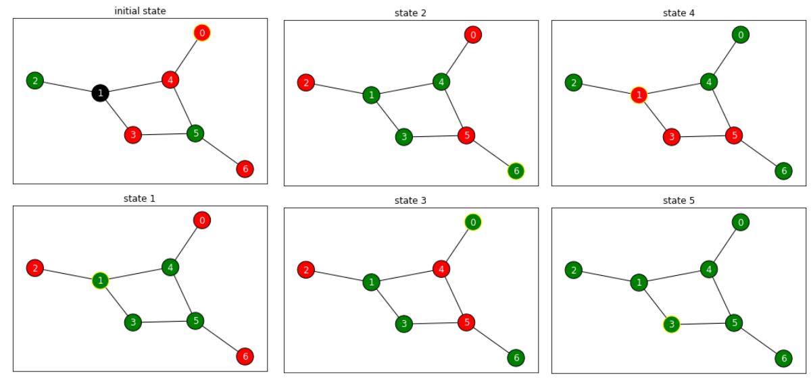

# Jade Swarm
> Implementation of uninformed and informed AI search algorithms in Rust, using a knock-off "Lights Out" game with an extra color as the problem.


## Table of Contents
- [Introduction](#Introduction)
- [Problem](#Problem)
- [Model](#Model)
- [Heuristic](#Heuristic)
- [See Also](#see-also)

## Introduction
This repository contains the implementation of the following search algorithms in Rust:
* Breadth First Search
* Depth First Search
* Iterative Deepening Search and Depth Limited Search
* Best First Search
* Uniform Cost Search
* A\* Search
* Iterative Deepening A\* Search
* Greedy Best First Search
* Recursive Best First Search 

## Problem
Jade Swarm is a game similar to Lights Out, with the deferences being that it has an extra color, and instead of being on a grid, the game is represented using an undirected graph.

The game starts with a graph that has its vertices colored in either Red or Green or Black. The objective of the player is to change the color all the vertices to Green using the following actions:
* Clicking on a green node causes all the non-black nodes around that node to change their colors from red to green or from green to red (a toggle).
* Clicking on a red node causes all the non-black nodes around that node to change their colors from red to green or from green to red (a toggle).
* Clicking on a black node first causes all the non-black nodes around that node to change their colors from red to green or from green to red (a toggle) and then if the number of green nodes around the clicked black node is more than the number of red nodes, the black node turns to green; if the number of red nodes around the clicked black node is more than the number of green nodes, the black node turns to red; otherwise, the black node stays black. 

Here is an example:


## Model
The model is available at:
[Model](./assets/jade-swarm-model.pdf)

## Heuristic
The description of the heuristic and the proof for consistency and admissibility is available at:
[Heuristic](./assets/jade-swarm-heuristic.pdf)


## Usage Guide
The tests are available in the main file. You can run them using
```
cargo run
```

## See Also
The implementation of the algorithms were influenced by the following book by Stuart Russell and Peter Norvig:
* [Artificial Intelligence: A Modern Approach, 4th](http://aima.cs.berkeley.edu/)
